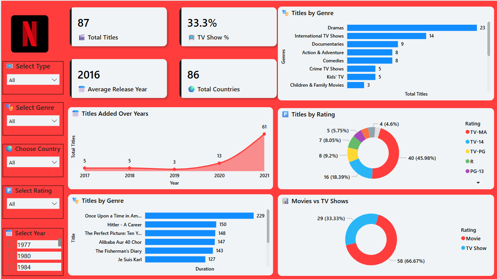

# 🎬 Netflix Data Analysis Dashboard (Power BI + SQL)

This project presents an interactive Power BI dashboard built from a cleaned Netflix dataset. It focuses on content trends across genres, ratings, release years, and availability by country, using a Netflix-inspired theme. SQL was used for initial data exploration and preprocessing to showcase complete data analysis skills.

---

## 📌 Objective

To analyze and visualize Netflix titles (movies and TV shows) across multiple dimensions using Power BI and SQL, and gain insights such as:

- Genre popularity
- Content type breakdown (Movies vs TV Shows)
- Rating distributions
- Country-wise availability
- Year-wise additions

---

## 🛠 Tools & Technologies

- **SQL** – Data exploration and initial filtering
- **Power BI** – Dashboard creation and interactive reporting
- **Power Query (M Language)** – Data cleaning inside Power BI
- **DAX** – KPI and calculated column creation

---

## 📁 Dataset

- Source: [Netflix Movies and TV Shows](https://www.kaggle.com/datasets/shivamb/netflix-shows)
- Total Rows: 8,800+ titles
- Columns: Title, Type, Genre, Rating, Cast, Director, Country, Date Added, Duration, etc.

---

## 🧹 Data Cleaning & Transformation

Performed using **Power Query + SQL**:

- Dropped null-heavy columns like `director`
- Replaced missing countries with `"Unknown"`
- Parsed `duration` column to extract **duration in minutes** for movies
- Converted `date_added` to `Year` for trend analysis
- Normalized inconsistent genres

---

## 🧮 Key SQL Queries (Exploratory Analysis)

```sql
-- Total titles by type
SELECT type, COUNT(*) AS total_titles
FROM netflix_data
GROUP BY type;

-- Top 5 genres
SELECT listed_in AS genre, COUNT(*) AS title_count
FROM netflix_data
GROUP BY listed_in
ORDER BY title_count DESC
LIMIT 5;

-- Titles added per year
SELECT strftime('%Y', date_added) AS year, COUNT(*) AS total
FROM netflix_data
GROUP BY year
ORDER BY year;

-- Average duration of movies
SELECT AVG(CAST(SUBSTR(duration, 1, INSTR(duration, ' ') - 1) AS INTEGER)) AS avg_duration
FROM netflix_data
WHERE type = 'Movie';
```

---

## 📊 Dashboard Features

### ✅ KPIs
- Total Titles
- Percentage of TV Shows
- Average Release Year
- Total Unique Countries

### ✅ Interactive Filters
- Content Type
- Genre
- Country
- Rating
- Release Year

### ✅ Charts & Visuals

| Visual | Purpose |
|--------|---------|
| **Bar Chart** – Titles by Genre | Most popular genres |
| **Donut Chart** – Ratings | Viewer suitability categories |
| **Line Chart** – Titles Added Over Years | Trend of content addition |
| **Bar Chart** – Duration of Top Movies | Longest movies on Netflix |
| **Pie Chart** – Movies vs TV Shows | Content distribution |

---

## 🎨 Theme

The dashboard uses a **Netflix-inspired red & black theme**, enhanced with icons and custom labels for better visual appeal and brand consistency.

---

## 📦 Output Preview

> 🖼️ Screenshot:  
> 

---

## 📍 Conclusion

This project showcases:
- End-to-end data analysis using **SQL**
- Professional dashboard creation using **Power BI**
- Strong data storytelling with Netflix content

---

## 📚 Future Improvements

- Integrate time series forecasting on content growth
- Include user ratings sentiment (if available)
- Deploy dashboard via Power BI service

---

## 🔗 Contact

**Nihar Karia**  
Aspiring Data Analyst/ Data Scientist | Python • SQL • Power BI 
